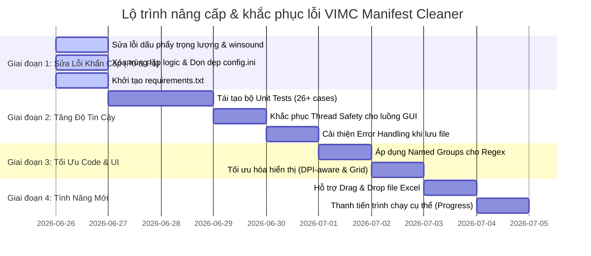

# 🗺️ Đánh Giá & Lộ Trình Cải Tiến (VIMC Manifest Cleaner)

Tài liệu này tổng hợp kết quả đánh giá kỹ thuật ứng dụng **VIMC Manifest Cleaner v3.0** và xác định lộ trình hành động chi tiết nhằm khắc phục các lỗi hiện tại, tối ưu hóa kiến trúc và nâng cấp tính năng.

---

## 🔍 1. Căn Cứ Đánh Giá Kỹ Thuật (Application Review)

### 📊 1.1 Bảng Điểm Tổng Hợp
Ứng dụng được đánh giá tổng thể đạt **7.5 / 10 điểm** (Mức Khá - Tốt cho ứng dụng nghiệp vụ nội bộ).

| Tiêu chí | Điểm | Nhận xét chi tiết |
| :--- | :---: | :--- |
| **Kiến trúc & Thiết kế** | ⭐⭐⭐⭐ | Thiết kế modular rõ ràng, separation of concerns tốt giữa giao diện (GUI) và xử lý dữ liệu (Core). |
| **Chất lượng Code** | ⭐⭐⭐⭐ | Code sạch, hỗ trợ type hints đầy đủ, docstrings chi tiết ở mọi hàm, ghi log khoa học. |
| **Nghiệp vụ (Business Logic)** | ⭐⭐⭐⭐⭐ | Hiểu sâu nghiệp vụ ngành hàng hải (tính toán F/E dựa trên tare weight, xử lý SOC/COC, map ISO sang VTOS, xử lý Same as Consignee). |
| **Giao diện (UI/UX)** | ⭐⭐⭐ | Đầy đủ chức năng (phím tắt, lịch sử file, bảng preview dữ liệu) nhưng kích thước cố định, chưa co giãn tốt theo DPI. |
| **Hệ thống Test** | ⭐⭐ | README đề cập có 26 test cases nhưng thực tế không tìm thấy thư mục kiểm thử trong mã nguồn. |
| **Độ ổn định & An toàn** | ⭐⭐⭐ | Cơ bản ổn định, tuy nhiên còn gặp vấn đề thread safety trên GUI và lỗi tương thích hệ điều hành (macOS/Linux). |

---

### 💪 1.2 Các Điểm Mạnh Cốt Lõi
1. **Kiến trúc Modular vững chắc**: Tách biệt rõ ràng thành `core/` (logic nghiệp vụ), `gui/` (giao diện), `config/` (cấu hình), và `utils/` (tiện ích). Giúp dễ dàng phát triển độc lập hoặc chuyển đổi giao diện sau này.
2. **Cơ chế Parsing thông minh với Fallback**: Hệ thống parsing 3 tầng tự động nhận diện định dạng tàu (MARINER, PIONEER, DANANG) kèm theo thang điểm tin cậy (confidence score) để người dùng đánh giá mức độ chính xác của kết quả.
3. **Tích hợp Domain Knowledge sâu sắc**: Tự động tính toán rỗng/đầy (F/E) dựa trên tare weight của từng loại container (20ft, 40ft, RF), nhận diện SOC/COC trực tiếp từ mô tả hàng hóa, tự động map tên cảng chuẩn VTOS.
4. **Hỗ trợ đa ngôn ngữ chuyên nghiệp**: Dữ liệu giao diện được đọc động từ các file `.ini` bên ngoài (`strings_en.ini` và `strings_vi.ini`), hỗ trợ chuyển đổi Anh/Việt nhanh chóng.

---

### ⚠️ 1.3 Các Vấn Đề Cần Khắc Phục (Lý do lập Lộ trình)

#### 🔴 Khẩn cấp (P0)
*   **Thiếu Safety Net (Unit Tests)**: Không có bộ test tự động khiến việc thay đổi các biểu thức chính quy (Regex) parsing cực kỳ rủi ro vì dễ gây lỗi dây chuyền (regression).
*   **Lỗi sai lệch dữ liệu trọng lượng**: Hàm `parse_weight_tons` đổi tất cả dấu phẩy thành dấu chấm một cách thô sơ (`"1,000"` thành `1.0` thay vì `1000.0`), gây lỗi nghiêm trọng về số liệu trọng tải tàu.
*   **Trùng lặp logic**: Lệnh gọi `is_empty_bl` bị lặp lại 2 lần liên tiếp trong tệp `excel_handler.py`.

#### 🟡 Trung bình (P1)
*   **Lỗi Crash trên macOS/Linux**: Khai báo `import winsound` trực tiếp mà không bọc trong khối kiểm tra lỗi khiến chương trình không khởi động được trên các hệ điều hành khác ngoài Windows.
*   **Không an toàn đa luồng (Thread Safety)**: Luồng xử lý file phụ cập nhật trực tiếp vào trạng thái dùng chung của giao diện mà không có cơ chế khóa, dễ sinh ra Race Condition nếu người dùng click liên tục.
*   **Regex khó bảo trì**: Các biểu thức chính quy phức tạp sử dụng chỉ mục nhóm (`group(1)`, `group(2)`) thay vì các nhóm có tên (Named Groups).

---

## 📌 2. Tổng Quan Lộ Trình Triển Khai (Roadmap)

---

## 🛠️ 3. Chi Tiết Kế Hoạch Thực Hiện Theo Giai Đoạn

### 🚀 Giai Đoạn 1: Khắc Phục Sự Cố & Dọn Dẹp (Quick Wins)
*Thời gian dự kiến: 1 ngày*

#### 1.1 Sửa hàm xử lý trọng lượng
*   **Nội dung**: Cập nhật hàm `parse_weight_tons` trong [parsers.py](file:///d:/UNG%20DUNG%20AI/TOOL%20AI%202026/Manifest%20Cleaner%20Final/VIMC/core/parsers.py) để phân biệt dấu phẩy phân cách phần nghìn (thousand separator) và dấu phẩy phân cách thập phân.
*   **Căn cứ**: Đánh giá lỗi P2-#10 (gây sai lệch nghiêm trọng trọng lượng hàng hóa).

#### 1.2 Hỗ trợ đa nền tảng cho âm thanh thông báo
*   **Nội dung**: Bọc lệnh `import winsound` trong [main_window.py](file:///d:/UNG%20DUNG%20AI/TOOL%20AI%202026/Manifest%20Cleaner%20Final/VIMC/gui/main_window.py) bằng khối lệnh `try...except ImportError`. Thiết lập cảnh báo âm thanh dạng fallback (ví dụ: dùng ký tự chuông hệ thống `print('\a')` hoặc bỏ qua) khi chạy trên macOS/Linux.
*   **Căn cứ**: Đánh giá lỗi P1-#5.

#### 1.3 Xóa bỏ code trùng lặp & Dọn dẹp config dư thừa
*   **Nội dung**:
    *   Xóa dòng gọi kiểm tra trùng lặp `is_empty_bl` thứ 2 trong [excel_handler.py](file:///d:/UNG%20DUNG%20AI/TOOL%20AI%202026/Manifest%20Cleaner%20Final/VIMC/core/excel_handler.py#L503-L508).
    *   Thêm chú thích lưu ý vào `config.ini` giải thích rõ đây là file legacy (hoặc xóa bỏ) để tránh nhầm lẫn cho nhà phát triển mới.
*   **Căn cứ**: Đánh giá lỗi P0-#2 và P0-#3.

#### 1.4 Tạo tài liệu cài đặt thư viện phụ thuộc (`requirements.txt`)
*   **Nội dung**: Tổng hợp các thư viện cần thiết như `pandas`, `openpyxl`, `tkinter` để người dùng/developer khác dễ dàng thiết lập môi trường bằng một lệnh duy nhất: `pip install -r requirements.txt`.
*   **Căn cứ**: Đánh giá lỗi P2-#12.

---

### 🛡️ Giai Đoạn 2: Tăng Cường Độ Tin Cậy & Bộ Test
*Thời gian dự kiến: 2 ngày*

#### 2.1 Xây dựng bộ Unit Tests
*   **Nội dung**: Tạo thư mục `tests/` ở thư mục gốc. Viết bộ kiểm thử tự động kiểm thử toàn diện các biểu thức chính quy (Regex) và logic xác định container, loại bỏ hoàn toàn rủi ro lỗi ngầm (silent regressions) khi sửa code sau này.
*   **Căn cứ**: Đánh giá lỗi P0-#1 (Thiếu Unit Tests).

#### 2.2 Đảm bảo Thread Safety cho giao diện GUI
*   **Nội dung**:
    *   Đặt `daemon=True` cho luồng xử lý file phụ để không khóa tiến trình tắt ứng dụng.
    *   Tự động khóa (disable) các nút "Browse", "Xử lý" khi luồng phụ đang chạy.
    *   Chuyển các biến dùng chung thành trạng thái được kiểm soát hoặc truyền qua tham số luồng an toàn.
*   **Căn cứ**: Đánh giá lỗi P1-#4.

#### 2.3 Hoàn thiện thông báo lỗi khi lưu Excel
*   **Nội dung**: Thay đổi kiểu trả về hoặc cơ chế ném lỗi của hàm `save` trong `excel_handler.py` để truyền thông điệp chi tiết đến giao diện người dùng thay vì chỉ trả về trạng thái True/False chung chung.
*   **Căn cứ**: Đánh giá lỗi P1-#7.

---

### 🏗️ Giai Đoạn 3: Tái Cấu Trúc Mã Nguồn (Refactoring)
*Thời gian dự kiến: 1-2 ngày*

#### 3.1 Cải tiến biểu thức chính quy với Named Groups
*   **Nội dung**: Thay đổi các biểu thức Regex lớn trong `parsers.py` sang dạng đặt tên nhóm (ví dụ: đặt tên nhóm số container, số seal, trọng lượng). Giúp mã nguồn tự tường minh hóa và không phụ thuộc vào vị trí chỉ mục nhóm.
*   **Căn cứ**: Đánh giá lỗi P1-#6.

#### 3.2 Tối ưu hóa kích thước giao diện động (Responsive GUI)
*   **Nội dung**: Thiết kế lại layout của giao diện chính sử dụng thuộc tính co giãn `weight` trong `grid` hoặc `pack(expand=True, fill=tk.BOTH)`. Bổ sung cơ chế tự nhận diện DPI màn hình để ứng dụng không bị vỡ/mờ chữ.
*   **Căn cứ**: Đánh giá lỗi P2-#8.

#### 3.3 Loại bỏ dead code Ship Type Indicator
*   **Nội dung**: Dọn sạch các hàm vẽ chỉ báo loại tàu bị comment out hoặc khôi phục lại tính năng này dưới một diện mạo tối giản, trực quan hơn.
*   **Căn cứ**: Đánh giá lỗi P2-#9.

---

### ✨ Giai Đoạn 4: Cải Tiến Tính Năng Mới
*Thời gian dự kiến: 1 ngày*

#### 4.1 Tính năng Kéo & Thả File (Drag-and-Drop)
*   **Nội dung**: Sử dụng thư viện `tkinterdnd2` cho phép người dùng kéo trực tiếp file manifest thô vào giao diện chính để xử lý ngay, tăng mạnh trải nghiệm UX.
*   **Căn cứ**: Đề xuất cải tiến UX dài hạn #12.

#### 4.2 Thanh tiến trình đo lường chính xác (Determinate Progress)
*   **Nội dung**: Đo số lượng B/L / số lượng dòng trong file manifest đầu vào và cập nhật thanh tiến trình theo tỉ lệ phần trăm hoàn thành, giúp người dùng ước lượng được thời gian chạy.
*   **Căn cứ**: Đề xuất cải tiến UX dài hạn #13.
